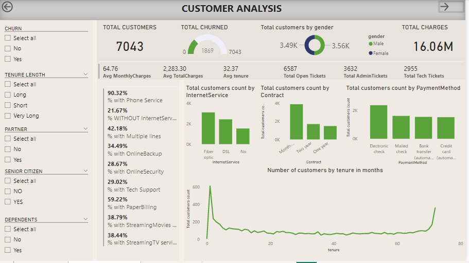
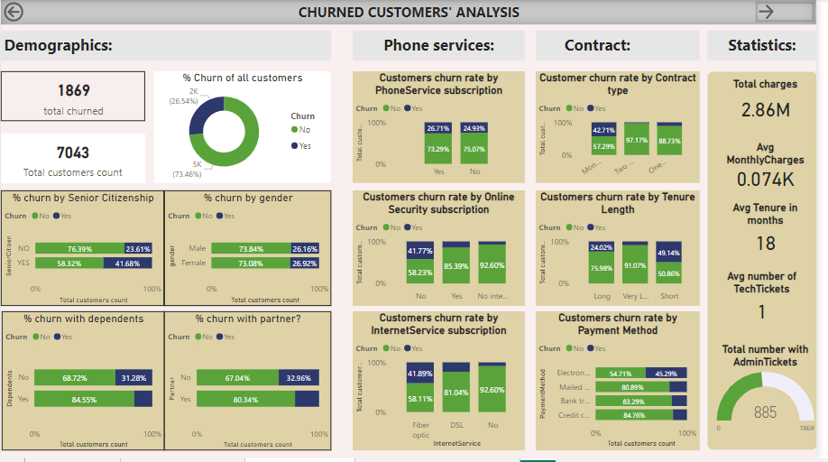
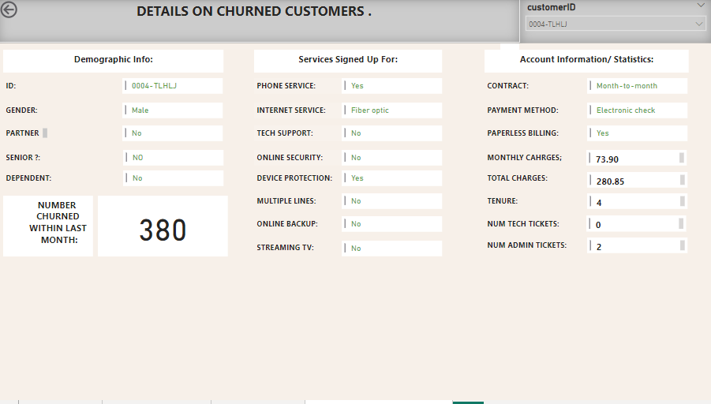
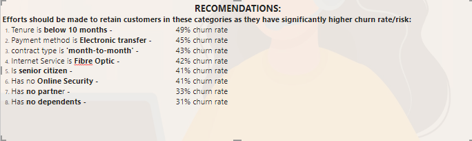
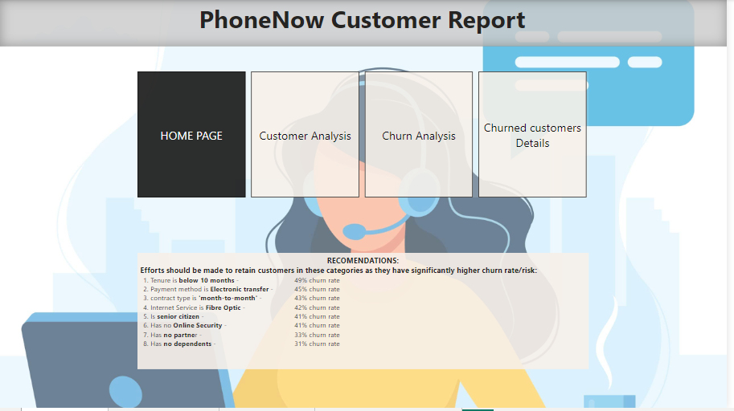

# CUSTOMER ANALYSIS REPORT FOR PHONENOW 

## Introduction 

This is a Powerbi report created as part of the required tasks to complete PWC’s virtual powerbi internship on Forage. The basic requirements and the datasets were provided by PWC

## Problem statement 

- The company wants to know more about all customers,  visualized clearly so that it’s self-explanatory for the management
- The company wants to identify customers that are at risk of churning so as to be able to reach out to them beforehand. As opposed to reaching out after they have terminated the contract which has made retention difficult.

## Skills demonstrated

- Defining relevant KPIs
- Data transformation in Power Query editor
- Creating a measure table and complex measure with DAX
- Data analysis and visualization   
- Multi page report building with proper navigation 
- Writing precise and clear report 

## Data sourcing

The customer dataset was provided by PWC in .xls format 

## Data transformation

- Set the right data type for all columns  
- Replaced the values 0 and 1 with ‘No’ and ‘Yes’ in the senior citizen column for the charts to be more understandable to the audience  
```Table.ReplaceValue(#"Changed Type","0","NO",Replacer.ReplaceText,{"SeniorCitizen"})```
- Rounded off the monthly charges and total charges column to 2 decimal places for running  clearer summary statistics
```Table.TransformColumns(#"Replaced Value1",{{"MonthlyCharges", each Number.Round(_, 2), type number}})```
- Created a TenureLength column using conditions from the tenure column. This column will allow the dataset to be grouped in a more discreet manner based on tenure months 
```Table.AddColumn(#"Rounded Off1", "TenureLength", each if [tenure] <= 10 then "Short" else if [tenure] <= 50 then "Long" else "Very Long")```
- Created a NumberOfOpenTickets column which is an addition of the tech and admin tickets. This column gives me information about the total number of tickets a customer holds 

## Data modeling

Only one dataset was used, so there was no modeling needed.

## Analysis and visualization 

- Created an interactive customers report page which could be filtered to show all available information about the customer base 
- Created an interactive churn/risk report page to show the behavior of churned customers and current customers that are in the same category 
- Created a third report page which can be filtered to show even more details about each individual churn 
- Wrote a comprehensive recommendation about current customers with the highest risk of churning 
- Created an home page with the quick recommendations and navigation buttons 

### Interact with the full report [here](https://app.powerbi.com/links/p2t0NLRUPJ?ctid=74a63f52-0cf3-4211-b66a-93c49f69cf62&pbi_source=linkShare)
